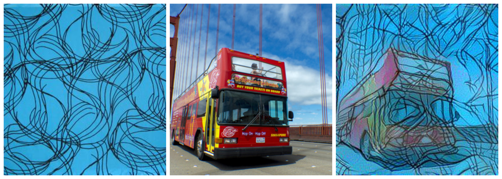
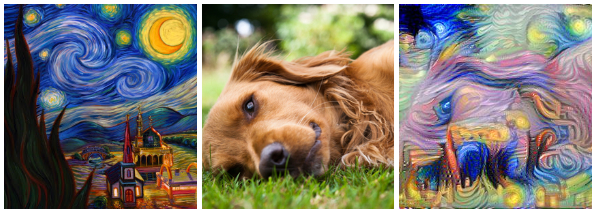
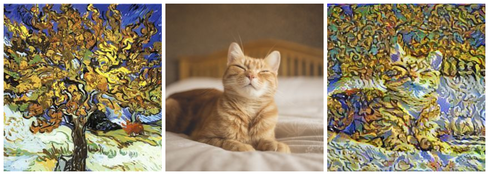
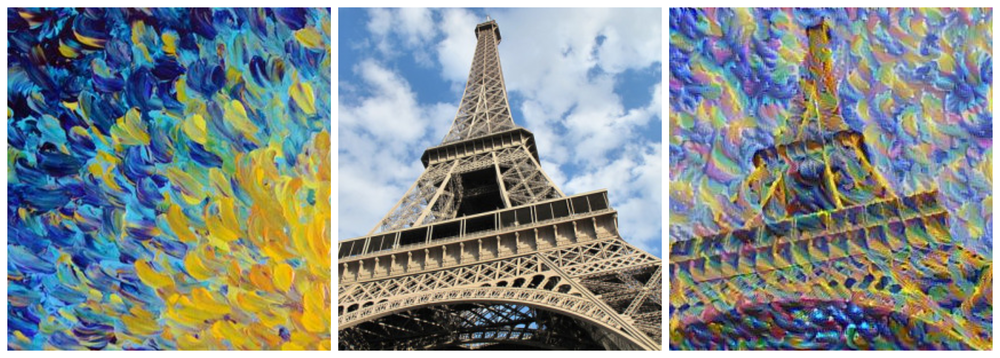

# Art generation using Neural Style Transfer

Neural Style Transfer - algorithm created by Gatys et al. (2015) (https://arxiv.org/abs/1508.06576). 

**Here we will**:
- Implement the neural style transfer algorithm
- Generate novel artistic images using the algorithm

## 1. Problem Statement
Neural Style Transfer (NST) is one of the most fun techniques in deep learning. As seen below, it merges two images, namely, a "content" image (C) and a "style" image (S), to create a "generated" image (G). The generated image G combines the "content" of the image C with the "style" of image S. 

For example, we are going to generate an image of the Louvre museum in Paris (content image C), mixed with a painting by Claude Monet, a leader of the impressionist movement (style image S).

## Output (Content Image + Style Image = Generated Image)

